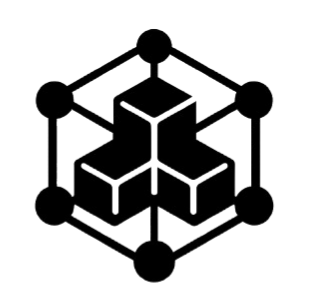
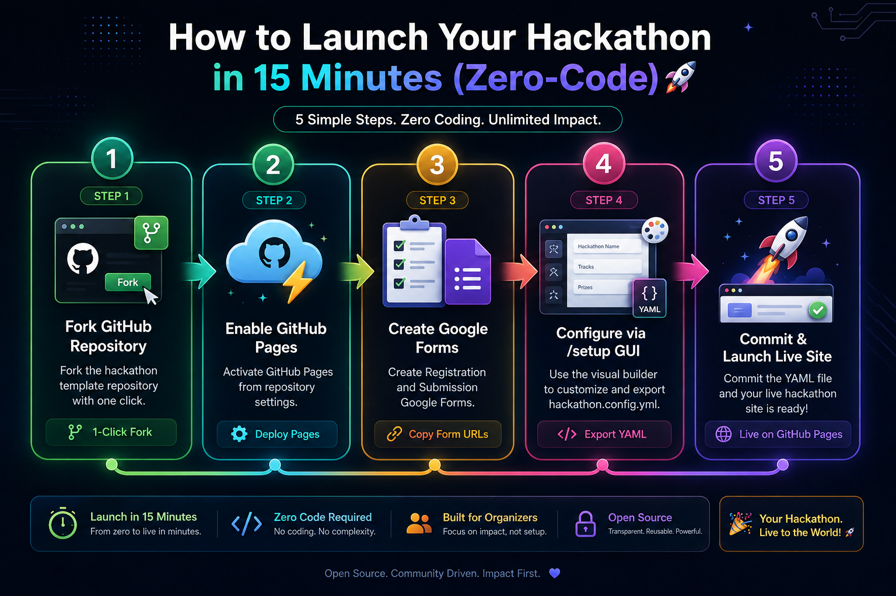

<h1>
  
  Reusable Rare Disease Hackathon Framework
</h1>

A flexible, configuration-driven web application framework designed to quickly launch PKU-first hackathon websites, with support for other rare disease communities too.

**What this repository does:** Fork this repo, edit one YAML configuration file with your PKU hackathon details, enable GitHub Pages, and your full hackathon website — complete with tracks, prizes, judges, schedule, FAQ, and submission flow — is live in minutes, with no coding required.

<div align="center">
  
  <br />
  <sub><b>Launch a complete hackathon website in 15 minutes with zero coding.</b></sub>
</div>

---

## Getting Started & Deployment Guide

To deploy your own PKU-first hackathon site:

1. Follow the step-by-step instructions in the **[Full Setup Guide (SETUP.md)](SETUP.md)** to fork this repository and enable GitHub Pages.
2. Customize your hackathon details via `hackathon.config.yml` or use the visual generator at `/setup` on your deployed site.

Your website address will be:
```text
https://YOUR-USERNAME.github.io/YOUR-REPOSITORY-NAME/
```

---

## Pre-Configured Disease Presets

The repository includes pre-built disease configuration templates under the [`configs/`](configs) directory:

| Disease / Template | File Path | Description |
| :--- | :--- | :--- |
| **PKU (Phenylketonuria)** | [`configs/hackathon.config.pku.yml`](configs/hackathon.config.pku.yml) | Primary default configuration and recommended starting point |
| **MSUD (Maple Syrup Urine Disease)** | [`configs/hackathon.config.msud.yml`](configs/hackathon.config.msud.yml) | MSUD science hackathon preset (BCAA, keto-acid tracking) |
| **Generic Template** | [`configs/hackathon.config.generic.yml`](configs/hackathon.config.generic.yml) | Blank starting template for any rare disease community |

---

## How to Reuse for a New Disease

### Option A: Visual GUI Generator
1. Open `/setup` on your deployed site or locally.
2. Enter your hackathon name, disease focus, tracks, prizes, and judges.
3. Click **Download YAML** and replace `hackathon.config.yml` in your repository.

### Option B: Switch Presets
Copy any preset from the `configs/` folder to the root `hackathon.config.yml`:

```bash
# Example: Switch to PKU Hackathon
cp configs/hackathon.config.pku.yml hackathon.config.yml
```

Push changes to GitHub to trigger automatic deployment.

---

## Documentation

- [Full Organizer Setup Guide (SETUP.md)](SETUP.md)
- [Local Preview Guide](LOCAL_PREVIEW.md)
- [Security & Compliance](SECURITY.md)

---

## Contributing & Collaboration

Contributions are welcome from developers, researchers, dietitians, and patient community members.

To get started:

1. Fork this repository and create a new branch for your changes.
2. Make your improvements — whether to templates, configuration presets, documentation, or the visual setup generator.
3. Open a Pull Request with a clear description of what you changed and why.

For questions, ideas, or collaboration opportunities, open an [Issue](issues) or reach out via the contact details in `hackathon.config.yml`.

